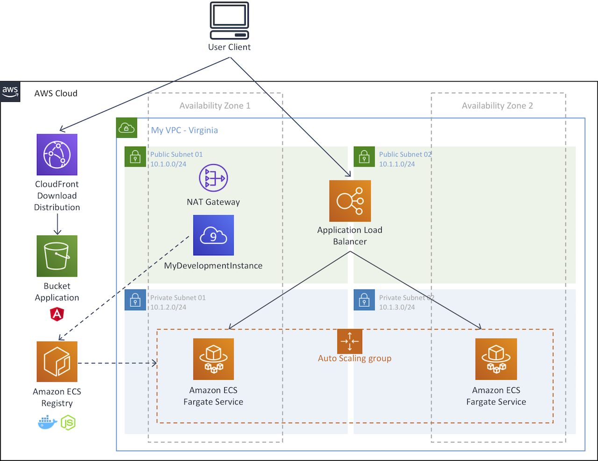

# Application Backend with Node.js and Frontend with Angular

Hello, this is a self-paced workshop designed to explore Amazon VPC, Amazon ECS, Amazon S3 and Amazon CloudFront.

## Modules

This workshop is broken up into multiple modules. you must complete the following modules in **US East (N. Virginia)** region in order before proceeding to the next:

1\. [Create your VPC and Application Load Balancer for backend.](tutorials/create-vpc-alb.md)

2\. [Prepare your development environment](tutorials/prepare-your-development-environment.md)

3\. [Deploy a Node.js backend with Amazon ECS](tutorials/deploy-backedn-with-ecs.md)

4\. [Deploy an Angular frontend with Amazon S3 and Amazon Cloudfront](tutorials/deploy-frontend-with-s3-and-cloudfront.md)