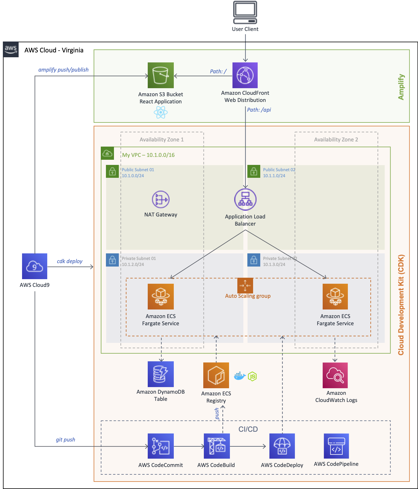

+++
title = "Workshop - Deploying Containers with AWS CDK v2 and React with AWS Amplify"
chapter = true
weight = 1
+++

Hello, this is a self-paced workshop to create a React application hosted on Amazon S3 and Amazon CloudFront. It shows a list of messages stored on an Amazon DynamoDB table. The messages are retrieved using a simple API based on Node.js within a Docker using Amazon Container Service. By the way, that container has continuous deployment enabled by using AWS CodePipeline.

**You will use AWS CDK v2 and AWS Amplify to create the services.**

* **Backend with:**
    * [**AWS Cloud Development Kit**](https://aws.amazon.com/cdk/)
* **Frontend with:**
    * [**AWS Amplify**](https://aws.amazon.com/amplify/framework/)

See the diagram below for a depiction of the complete architecture.

**If the resources that you use for this workshop are left undeleted you will incur charges on your AWS account.**