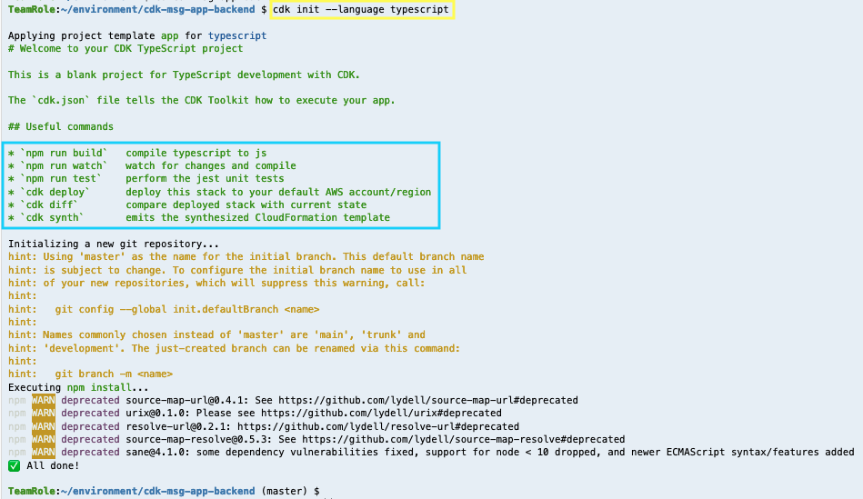
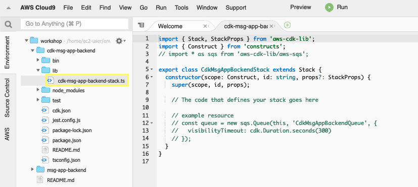

2.1\. Create a directory for your app with an empty Git repository.

``` bash
cd ~/environment/
mkdir cdk-msg-app-backend
cd cdk-msg-app-backend
```

2.2\. To initialize your new AWS CDK app use the **cdk init** command as follows.

``` bash
cdk init --language typescript
```



2.3\. Install the AWS modules and all it’s dependencies into your project.

``` bash
npm install \
@aws-cdk/aws-ec2 \
@aws-cdk/aws-ecs \
@aws-cdk/aws-ecr \
@aws-cdk/aws-ecs-patterns \
@aws-cdk/aws-iam \
@aws-cdk/aws-dynamodb \
@aws-cdk/aws-elasticloadbalancingv2 \
@aws-cdk/aws-codecommit \
@aws-cdk/aws-codebuild \
@aws-cdk/aws-codepipeline \
@aws-cdk/aws-codepipeline-actions
```


2.4. Explore your project directory, you will have the following files:

* **lib/cdk-msg-app-backend-stack.ts** is where your CDK application’s main stack is defined. This is the file we’ll working on.

* **bin/cdk-msg-app-backend.ts** is the entrypoint of the CDK application. It will load the stack defined in lib/cdk-msg-app-backend-stack.ts.

