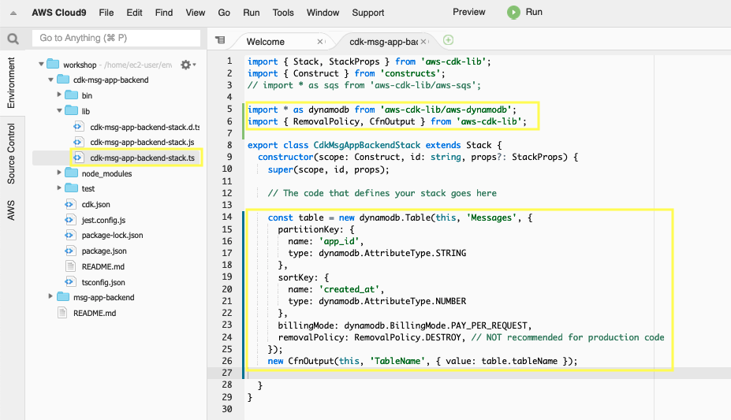
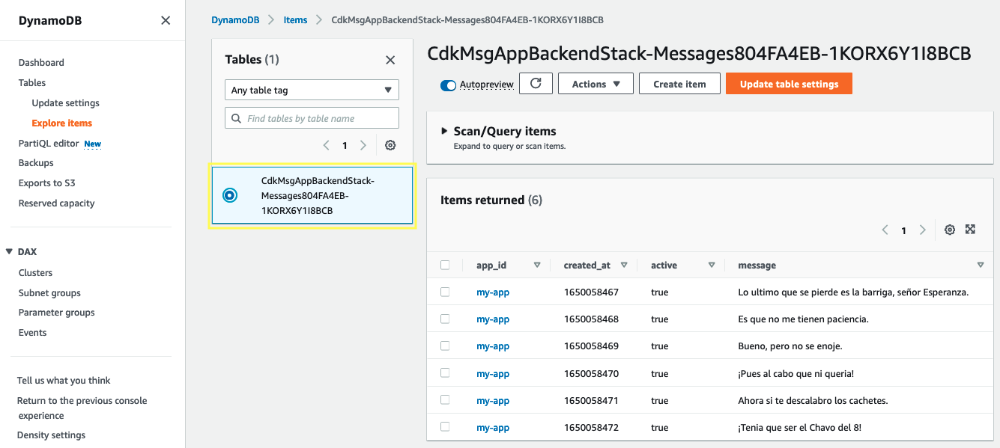

3.1\. In **lib/cdk-msg-app-backend-stack.ts**, add the following below the last import.

``` typescript
import * as dynamodb from '@aws-cdk/aws-dynamodb';
```

3.2\. In **lib/cdk-msg-app-backend-stack.ts**, replace the comment "**The code that defines your stack goes here**" at the end of the constructor with the following code.

``` typescript
    const table = new dynamodb.Table(this, 'Messages', {
      partitionKey: {
        name: 'app_id',
        type: dynamodb.AttributeType.STRING
      }, 
      sortKey: {
        name: 'created_at',
        type: dynamodb.AttributeType.NUMBER
      },
      billingMode: dynamodb.BillingMode.PAY_PER_REQUEST,
      removalPolicy: cdk.RemovalPolicy.DESTROY, // NOT recommended for production code
    });
    new cdk.CfnOutput(this, 'TableName', { value: table.tableName });
```



3.3\. Save it and make sure it builds and creates a stack.

``` bash
npm run build
cdk synth
```

3.4\. Deploy the stack.

``` bash
cdk deploy
```


3.5\. Open the Amazon DynamoDB console in **Tables** section https://console.aws.amazon.com/dynamodb/home?#tables:, you will see the **messages** table.

3.6 Go to your Node.js project folder.

``` bash
cd ~/environment/msg-app-backend/
```

3.7\. Obtain the DynamoDB Table name created and export it as an environment variable with the following command.

``` bash
export MY_TABLE_NAME=`aws cloudformation describe-stacks --stack-name CdkMsgAppBackendStack | jq '.Stacks[0].Outputs[0].OutputValue' | tr -d \"`
echo $MY_TABLE_NAME
```

3.8\. Feed the DynamoDB Table with some messages.

``` bash
python db/batch_writing.py
```

3.9\. Open the Amazon DynamoDB console in **Tables** section [https://console.aws.amazon.com/dynamodb/home?#tables](https://console.aws.amazon.com/dynamodb/home?#tables), select your table and explore the **Items** inserted.

