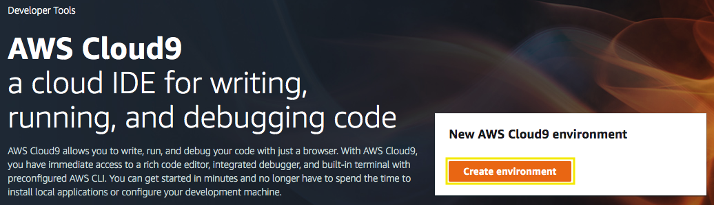
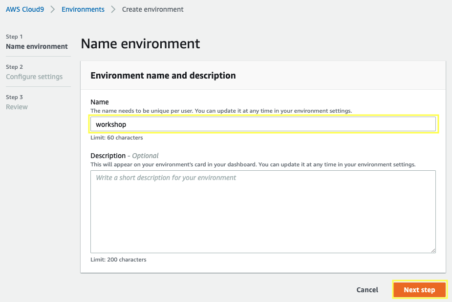
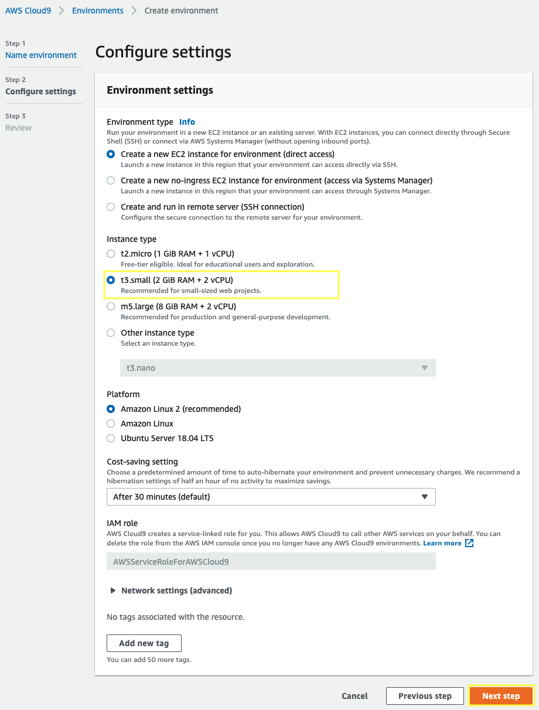
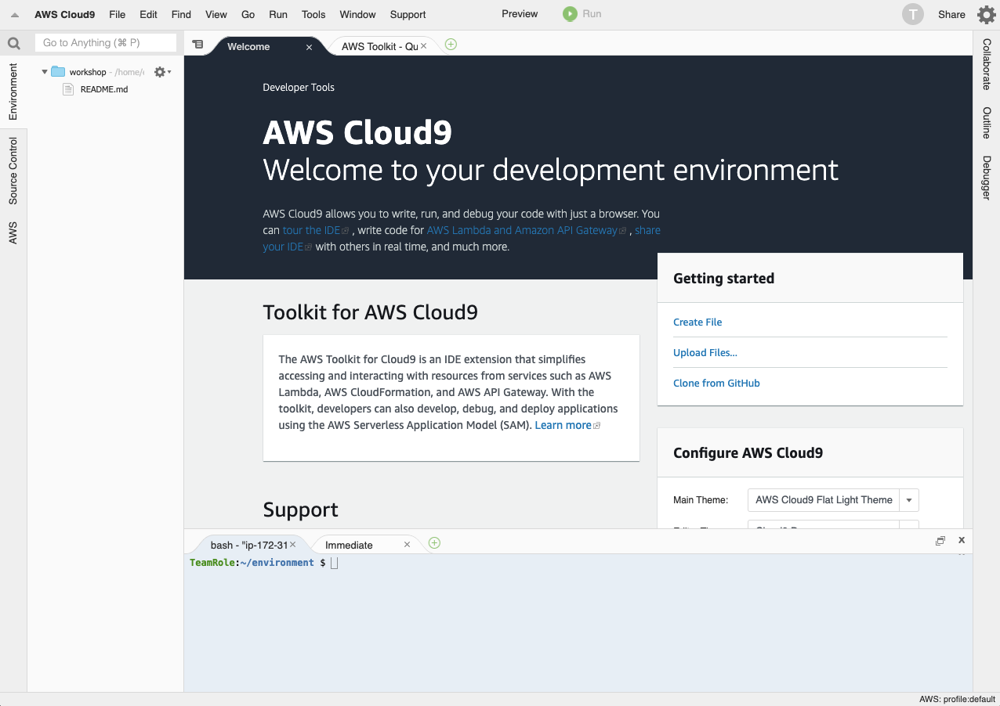

2.1\. Open the AWS Cloud9 console at https://console.aws.amazon.com/cloud9/.

2.2\. Click on **Create environment**.

2.3\. For the **Name** type `workshop`, and choose **Next step**.

2.4\. For the **Configure settings** section, select the instance type **t3.small** and choose **Next step**.

2.5\. For the **Review** section click on **Create environment**.

2.6\. Wait a few seconds until your development environment is ready, you will see the following screen.

