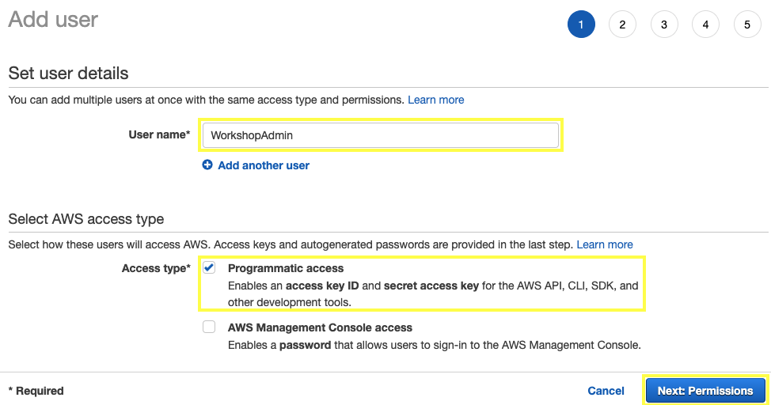
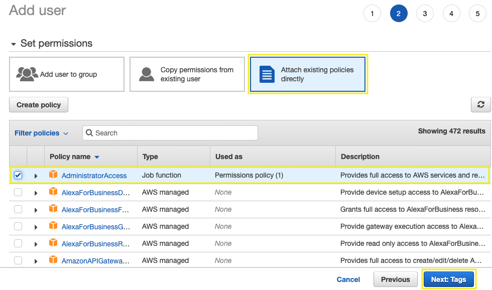
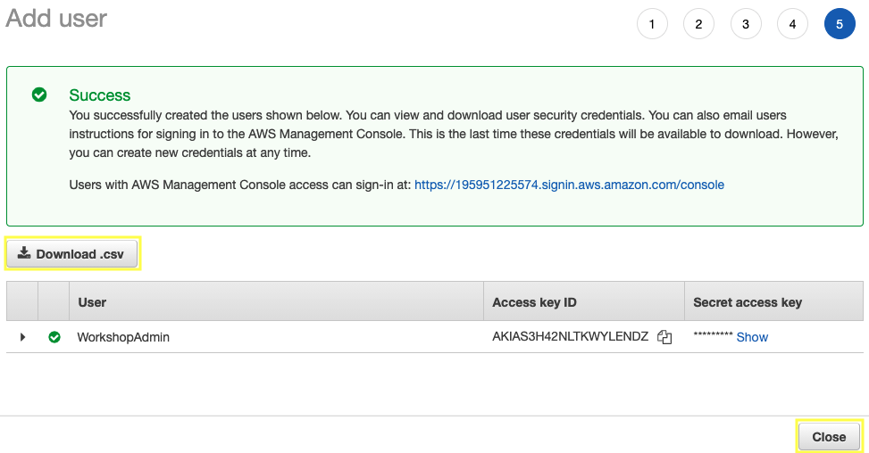

1.1\. Open the IAM console at https://console.aws.amazon.com/iam/.

1.2\. Choose **Users**, then **Add user**.

1.3\. Type a name for your user `WorkshopAdmin`, choose **Programmatic access** and click **Next: Permissions**.

1.4\. Click **Attach permissions policies** and select **Administrator Access**, choose **Next: Tags**.

1.5\. For **Add tags** choose **Next: Review**.

1.6\. Click **Create user**.

1.7\. To save the credentials, choose **Download .csv** and then save the file to a safe location, and **Close**.

