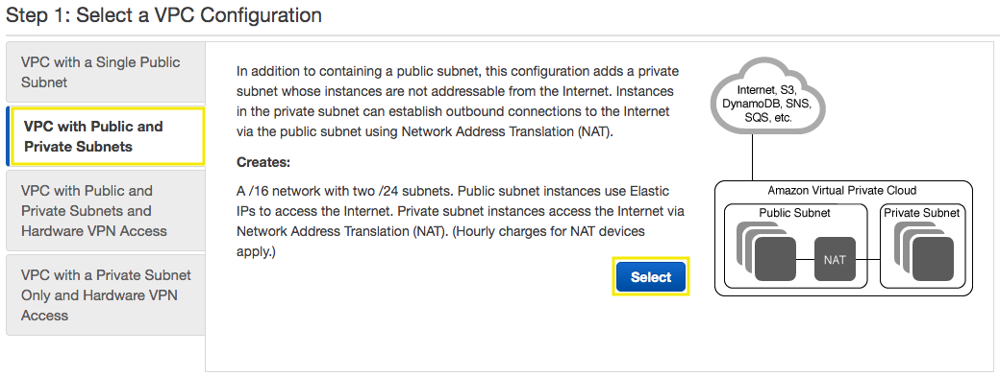
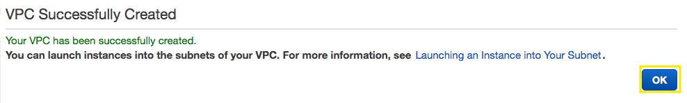
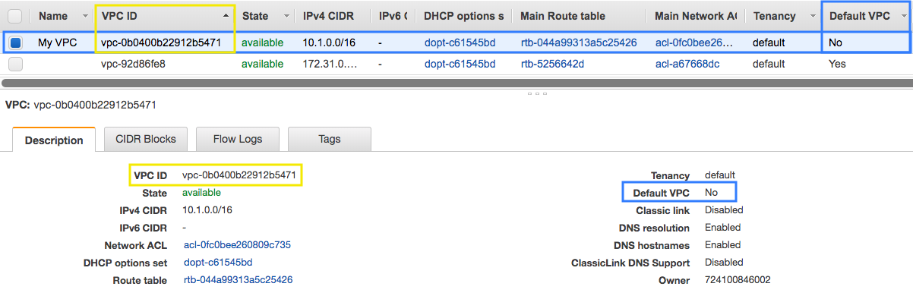
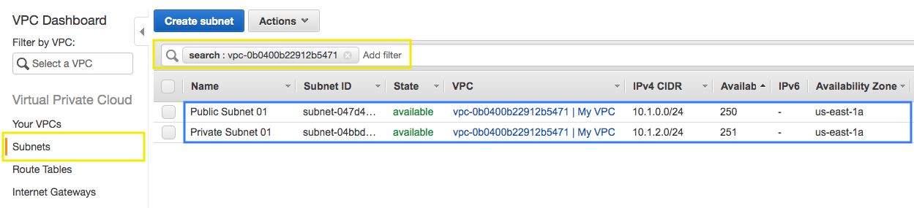
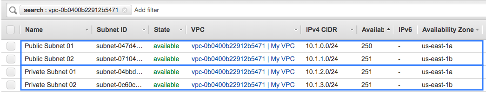
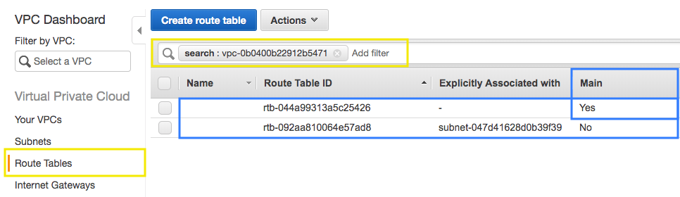
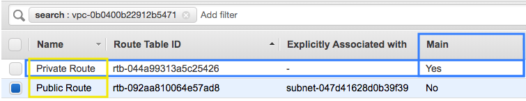
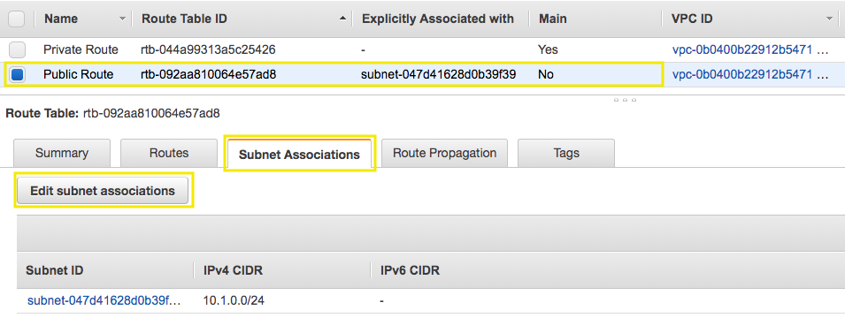
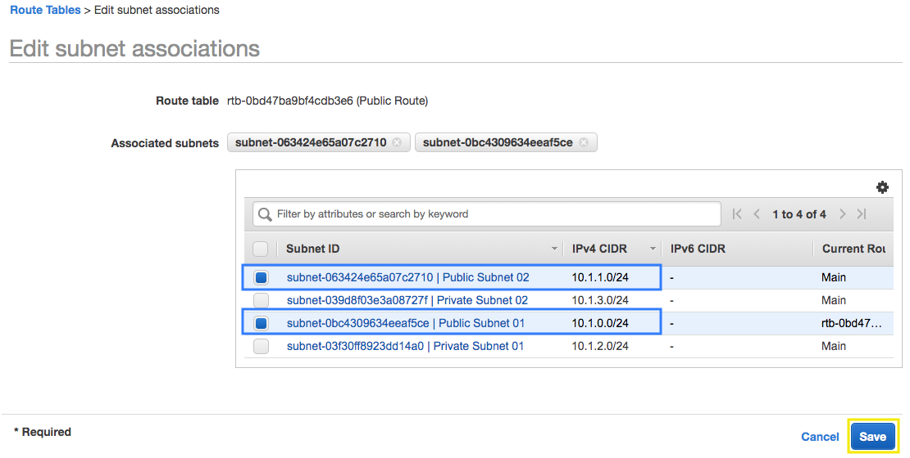
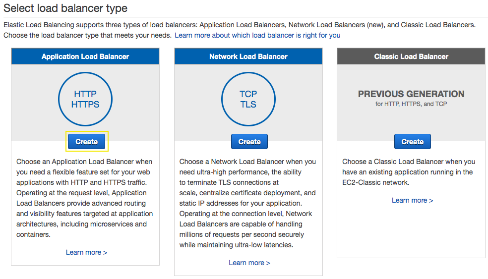

# Create your VPC and Application Load Balancer for backend

## 1. Create an Elastic IP for the NAT Gateway

1.1\. Open the Amazon EC2 console at https://console.aws.amazon.com/ec2/.

1.2\. In the navigation pane, choose **Elastic IPs**.

1.3\. Choose **Allocate new address**.

1.4\. For **IPv4 address pool**, choose **Amazon pool**.

1.5\. Choose **Allocate**, and close the confirmation screen.

1.6\. Note the **Allocation ID** for your newly created Elastic IP address; you enter this later in the VPC wizard.

## 2. Create a VPC using the Amazon VPC Wizard

2.1\. Open the Amazon VPC console at https://console.aws.amazon.com/vpc/.

2.2\. In the navigation pane, choose **VPC Dashboard**. From the dashboard, choose **Launch VPC Wizard**.

2.3\. Choose the second option, **VPC with Public and Private Subnets**, and then choose **Select**.

2.4\. On the configuration page, enter the following information and choose **Create VPC**.

* **IPv4 CIDR block:** `10.1.0.0/16`
* **VPC name:** `My VPC`
* **Public subnet's IPv4 CIDR:** `10.1.0.0/24`
* **Availability Zone:** `us-east-1a`
* **Public subnet name:** `Public Subnet 01`
* **Private subnet's IPv4 CIDR:** `10.1.2.0/24`
* **Availability Zone:** `us-east-1a`
* **Private subnet name:** `Private Subnet 01`
* **Elastic IP Allocation ID:** Select your Allocation ID previously created `eipalloc-XXXXXXXXXXXXXX`
* **Enable DNS hostnames:** `Yes`

2.5\. A status window shows the work in progress, when the wizard is finished, choose **OK**.

2.6\. Note that the page displays your VPCs. The VPC that you created is a nondefault VPC, therefore the **Default VPC** column displays **No**, copy the **VPC ID** of **My VPC**.

2.7\. In the navigation pane, choose **Subnets**, apply a filter using the **VPC ID** that you copied and press enter, you will see two subnets created from your VPC in availability zone a (us-east-1a).

!!! info
    For greater availability, you should create at least one more of each subnet type in a different Availability Zone so that your VPC has both public and private subnets across two Availability Zones.

2.8\. For the second public subnet, choose **Create subnet** and enter the following information and choose **Create**.

* **Name tag**: `Public Subnet 02`
* **VPC**: `My VPC`
* **Availability Zone**: `us-east-1b`
* **IPv4 CIDR block**: `10.1.1.0/24`

2.9\. For the second private subnet, choose **Create subnet** and enter the following information and choose **Create**.

* **Name tag**: `Private Subnet 02`
* **VPC**: `My VPC`
* **Availability Zone**: `us-east-1b`
* **IPv4 CIDR block**: `10.1.3.0/24`

2.10\. With the filter applied with your VPC ID, now you will see the four subnets, two publics and two privates.

2.11\. In the navigation pane, choose **Route Tables** and apply a filter using your VPC ID, note that one of your route tables for the **Main** column displays **Yes**.

2.12\. Edit the names, mouse over the column **Name** and click on the pencil, for the **Main** route table type `Private Route` and for the other one type `Public Route`.

2.13\. Select your **Public Route**, click on **Subnet Associations** and click on **Edit subnet associations**.

2.14\. Select the subnets **10.1.0.0/24** (Public Subnet 01) and **10.1.1.0/24** (Public Subnet 02) and click on **Save**.

## 3. Create the Application Load Balancer for the Backend

3.1\. Open the Amazon EC2 console at https://console.aws.amazon.com/ec2/.

3.2\. In the navigation pane, under **LOAD BALANCING**, choose **Load Balancers**.

3.3\. Choose **Create Load Balancer**.

3.4\. On the **Select load balancer type** page, choose **Application Load Balancer** and then choose **Create**.

3.5\. Complete the **Configure Load Balancer** page as follows:

* **``Name``**: `backend`
* **``Scheme``**: **``internet-facing``**
* **``IP address type``**: **``ipv4``**
* **``Listeners``**: The default listener that accepts **``HTTP``** traffic on port **``80``**.
* **``VPC``**: **``My VPC``**
* **``Availability Zones``**: Select the check box for the Availability Zones to enable for your load balancer. For **``us-east-1a``** select the **``Public Subnet 01``** and for **``us-east-1b``** select **``Public Subnet 02``**.

3.6\. Choose **Next: Configure Security Settings** and choose **Next: Configure Security Groups**.

3.7\. Select **Create a new security group**, for the Security group name type `backend-alb` and choose **Next: Configure Routing**.

3.8\. In the **Configure Routing** section, for **Name** type `backend`, for Target type, choose to register your targets with an **IP** address and choose **Next: Register Targets**.

3.9\. Choose **Next: Review**, click on **Create** and **Close**.