# Deploying an Angular frontend with Amazon S3 and Amazon CloudFront

## 1. Create an Amazon S3 to host your Frontend application

1.1\. Open the Amazon S3 console at https://s3.console.aws.amazon.com/s3/.

1.2\. Choose **Create bucket**.

1.3\. In the **Bucket name** field, type a unique **DNS-compliant** name for your new bucket, for example `alias-frontend`. Create your own bucket name using the follow naming guidelines:

* The name must be unique across all existing bucket names in Amazon S3.
* After you create the bucket you cannot change the name, so choose wisely.
* Choose a bucket name that reflects the objects in the bucket because the bucket name is visible in the URL that points to the objects that you're going to put in your bucket.

1.4\. For **Region**, choose **US East (N. Virginia)** as the region where you want the bucket to reside.

1.5\. Choose **Create**.

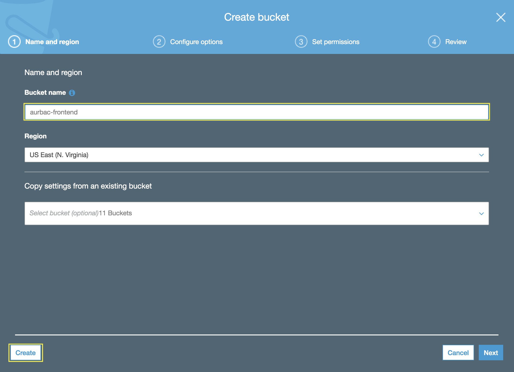


## 2. Install the global dependencies in your development environment

2.1\. Open the AWS Cloud9 console at https://console.aws.amazon.com/cloud9/.

2.2\. In the list of environments, for the environment you want to open, inside of the card, choose **Open IDE**.


2.3\. Update Node.js to the minimal version of 10.

``` bash
nvm i v10
```

2.4\. Install the Angular CLI globally.

``` bash
npm install -g @angular/cli
```

## 3. Clone the repository project from GitHub

3.1\. Clone the Github project and install dependencies.

``` bash
git clone https://github.com/aurbac/msg-app-frontend.git
cd msg-app-frontend/
npm install
```

## 4. Upload Angular application to Amazon S3

4.1\. Edit the file **src/environments/environment.prod.ts** and change the value **path** with to your **`http://load-balancer-dns-name/api`** and save the file, use the editor included in Cloud9 environment.

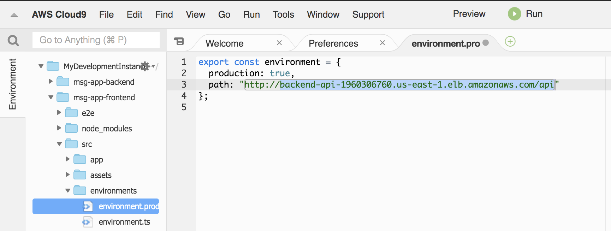

4.2\. Build the angular application for distrbution.

``` bash
ng build --prod
```

4.3\. Upload the distribution files to your bucket, change `<your-bucket-name>` with your bucket name created.

``` bash
aws s3 sync dist/frontend/ s3://<your-bucket-name>/
```

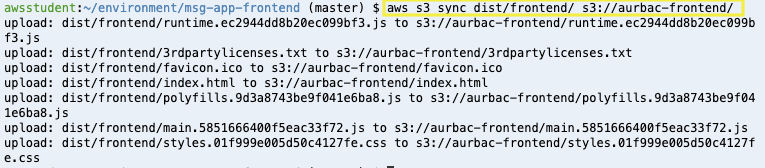

## 5. Deliver you application using Amazon CloudFront

5.1\. Open the Amazon CloudFront console at https://console.aws.amazon.com/cloudfront/.

5.2\. Choose **Create Distribution**.


5.3\. For **Web** choose **Get Started**.

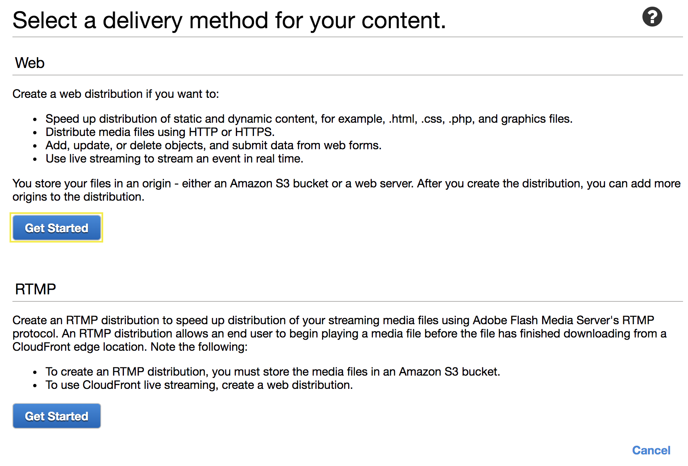

5.4\. Complete the **Origin Settings** section as follows:

* **Origin Domain Name**: Select your bucket name created.
* **Restrict Bucket Access**: **``Yes``**
* **Origin Access Identity**: **``Create a New Identity``**
* **Grant Read Permissions on Bucket**: **``Yes, Update Bucket Policy``**

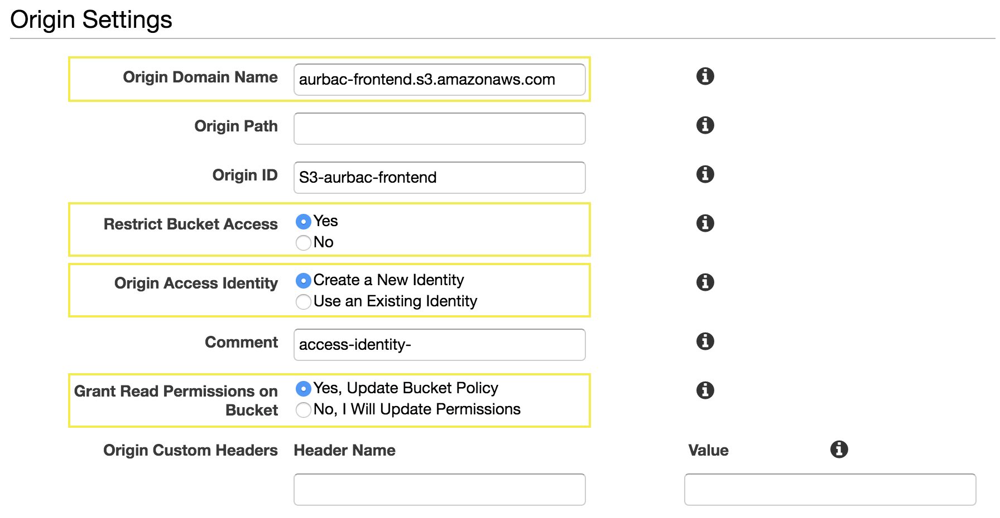

5.5\. Scroll down, in the **Distribution Settings** section, for **Default Root Object** type `index.html`.

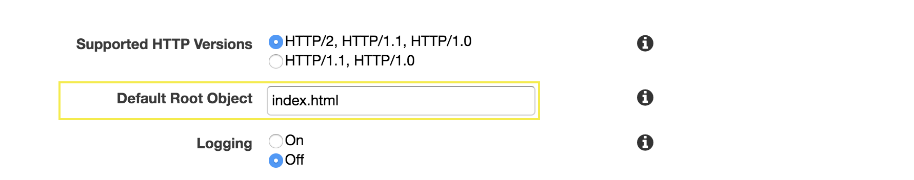

5.6\. Click on **Create Distribution** and wait a few minutes to apply the changes.

5.7\. Go back to https://console.aws.amazon.com/cloudfront/, once the distribution **Status** changes from **In Progress** to **Deployed**, copy the **Domain name** of your CloudFront distribution to test in your browser, you will see the message **Welcome to frontend!**.


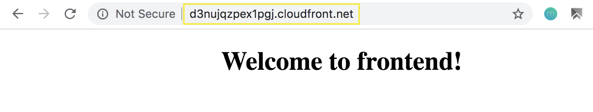

5.8\. Test in your browser the application messages `<domain-name>/messages`, you will see an **Access Denied** error.


5.9\. Finally, now we need to configure **403** or **404** errors to redirect the traffic to index.html to resolve /messages.

5.10\. Select your distribution and click on **Distribution Settings**.

5.11\. Go to **Error Pages** tab and click on **Create Custom Error Response**.


5.12\. For **Custom Error Response Settings** complete as follows and click on **Create**:

* **HTTP Error Code**: **``403: Forbidden``**
* **Customize Error Response**: **``Yes``**
* **Response Page Path**: **``/index.html``**
* **HTTP Response Code**: **``200: Ok``**

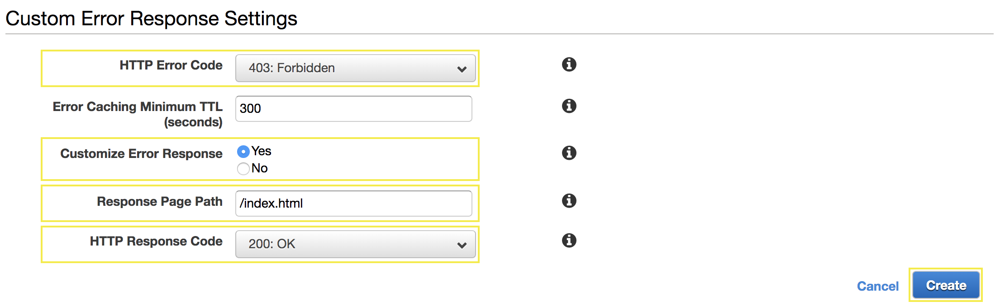

5.13\. Repeat the last process to create a new Custom Error Response for the **HTTP Error Code**: **``404: Not Found``**, now you have the following two custom error response.

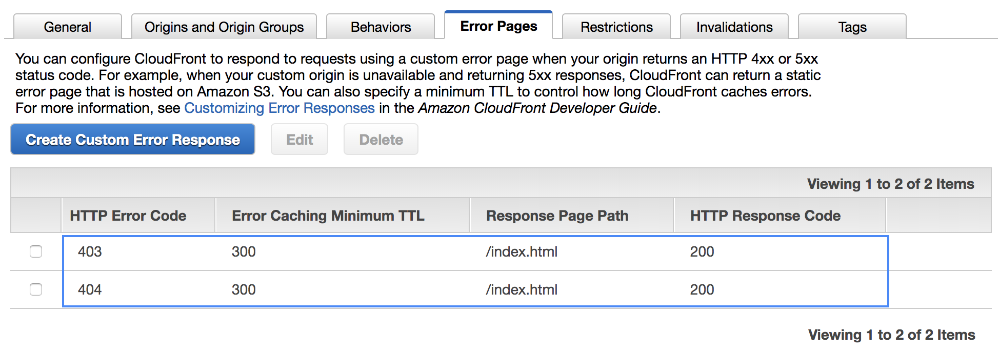

5.14\. Go back to https://console.aws.amazon.com/cloudfront/ and wait a few minutes to apply the changes, once the distribution **Status** changes from **In Progress** to **Deployed** you can continue.


5.15\. Now test in your browser the application messages `<domain-name>/messages`, you will see the messages from backend.

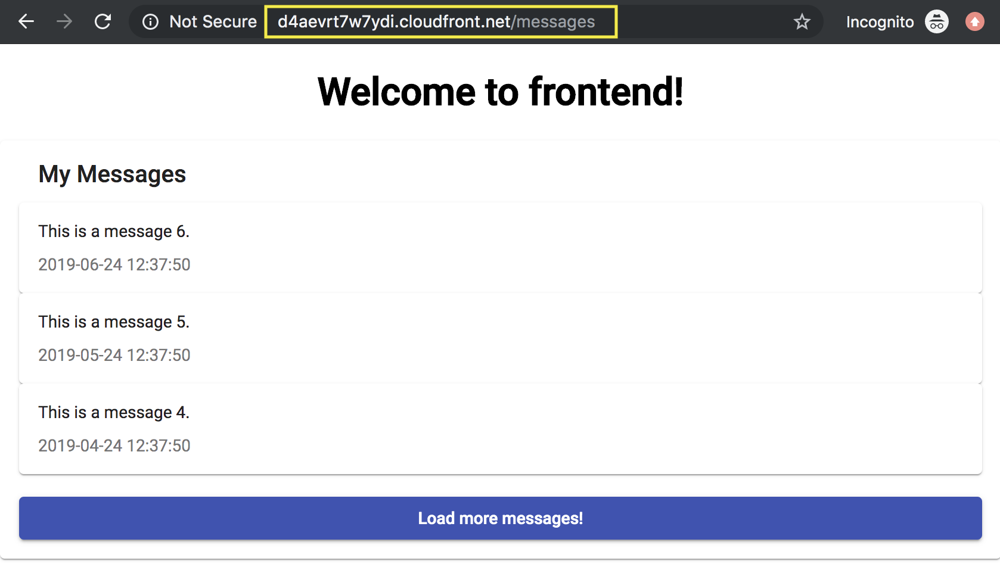

!!! done
    **Now you have an Angular Application stored on Amazon S3 and a Nodejs backend using containers with Amazon ECS. 
    
!!! info
    Note that you are using HTTP (Not secure connection), next step we are going to include our API to be delivered also with CloudFront and use **HTTPS**.

## 6. Configure backend with Amazon CloudFront

6.1\. Open the Amazon CloudFront console at https://console.aws.amazon.com/cloudfront/.

6.2\. Choose your distribution and click on Distribution Settings.

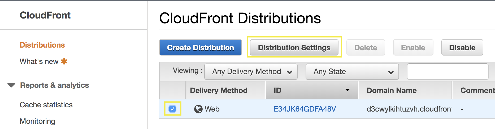

6.3\. Go to **Origins and Origin Groups** tab and click on **Create Origin**.

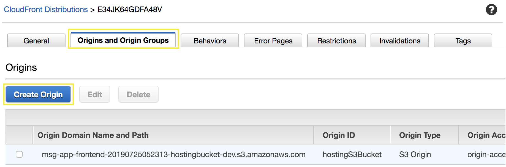

6.4\. For **Create Origin** select your Application Load Balancer and choose **Create**.

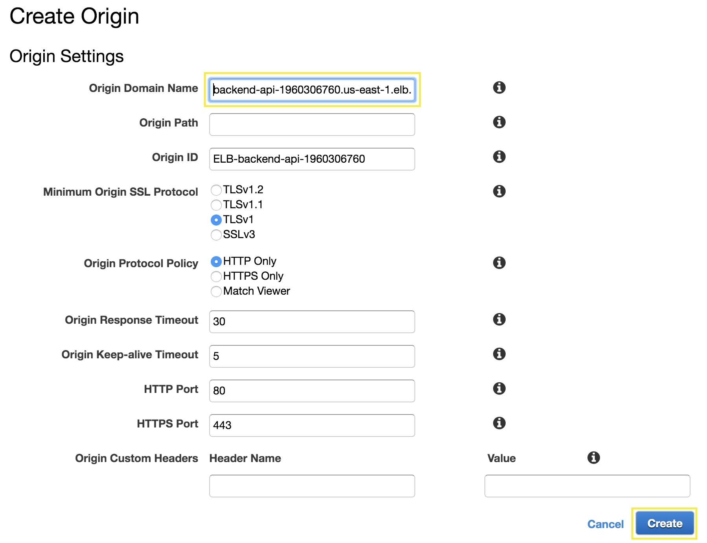

6.5\. Go to **Behaviors** tab and click on **Create Behavior**.

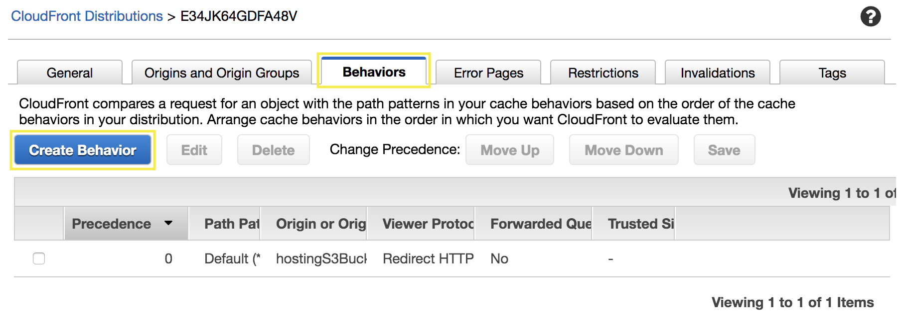

6.6\. For **Create Behavior** complete as follows and choose **Create**:

* **Path Pattern**: **``/api*``**
* **Origin or Origin Group**: **``ELB-Backend-XXXXX``**
* **Allowed HTTP Methods**: **``GET, HEAD, OPTIONS, PUT, POST, PATCH, DELETE``**
* **Cache Based on Selected Request Headers**: **``All``**
* **Forward Cookies**: **``All``**
* **Query String Forwarding and Caching**: **``Forward all, cache based on all``**

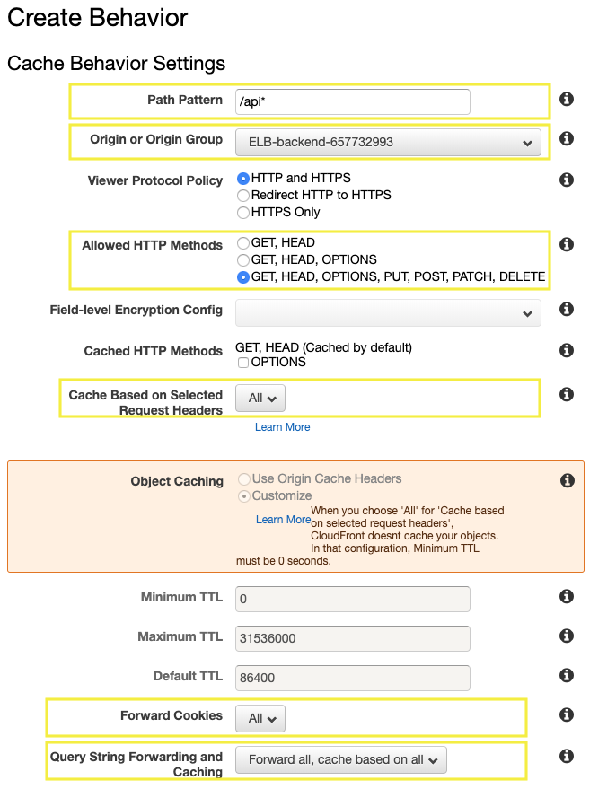

## 7. Update Angular project with backend CloudFront

7.1\. Edit the file **src/environments/environment.prod.ts** and change the value **path** with to your **`https://cloudfront-domain-name/api`** and save the file, use the editor included in Cloud9 environment.

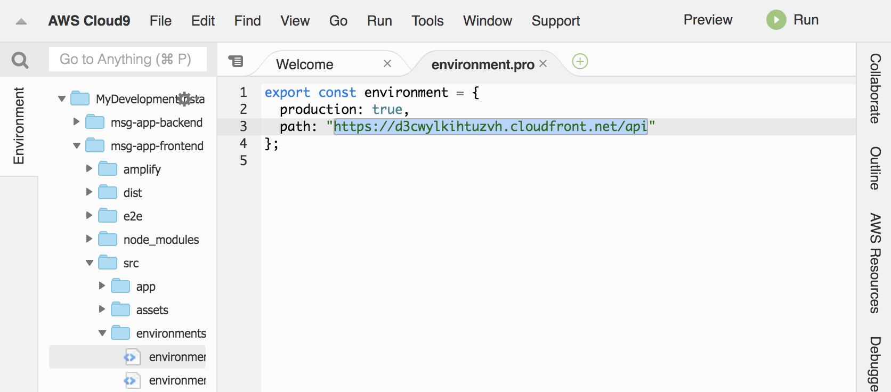

7.2\. Build the angular application for distrbution.

``` bash
ng build --prod
```

7.3\. Upload the distribution files to your bucket, change `<your-bucket-name>` with your bucket name created.

``` bash
aws s3 sync dist/frontend/ s3://<your-bucket-name>/
```

7.4\. Now test in your browser the application messages using **HTTPS**, `https://cloudfront-domain-name/messages`, you will see the messages from backend.

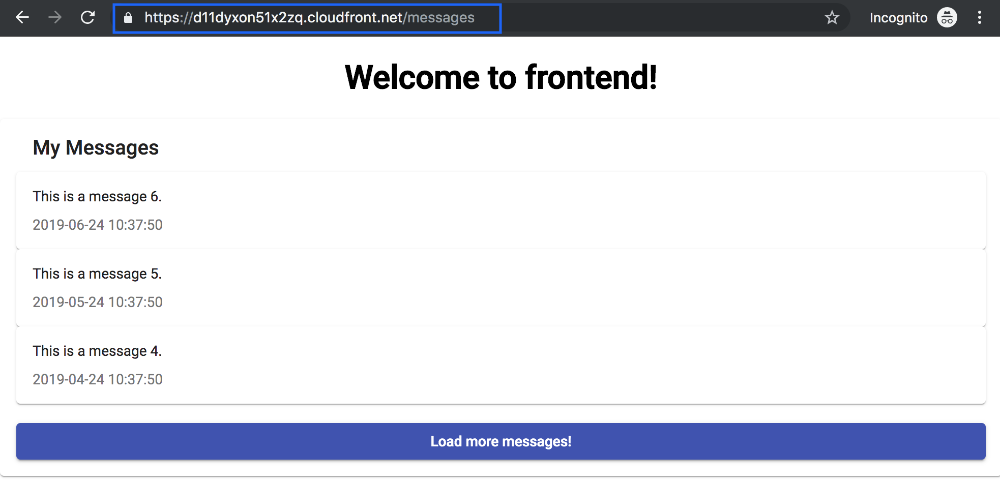

!!! done
    **Now you have an Angular Application stored on Amazon S3 and a Nodejs backend using containers with Amazon ECS.**