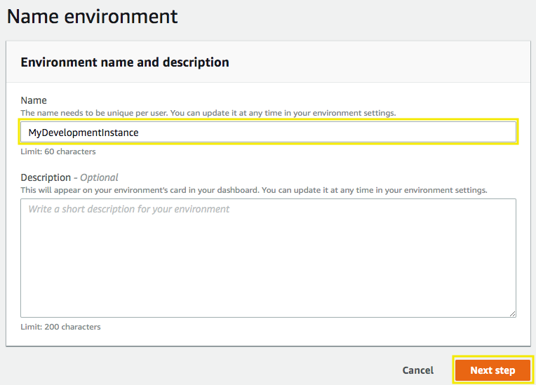
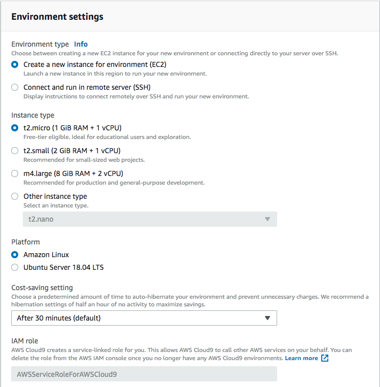
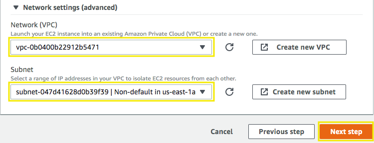
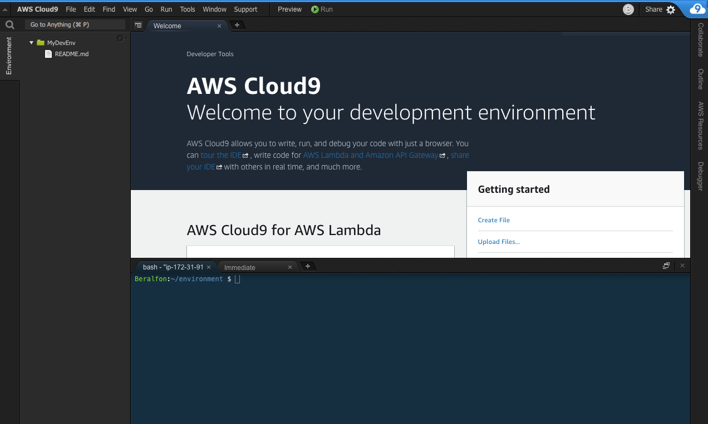
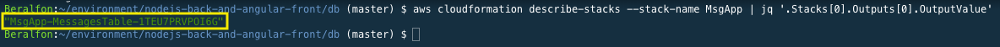

# Prepare your development environment and create DynamoDB Table

## 1. Create Cloud9 instance for development

1.1\. Open the AWS Cloud9 console at https://console.aws.amazon.com/cloud9/.

1.2\. Click on **Create environment**.


1.3\. For the **Name** type `MyDevEnv`, and choose **Next step**.



1.4\. For the **Environment settings** use the default values.



1.5\. For the **Network settings (advanced)**, expand the section and select your **VPC ID** and **Public Subnet 01** and choose **Next step**. Identify your Subnet Id going back to your subnets list https://console.aws.amazon.com/vpc/home?region=us-east-1#subnets.



1.6\. For the **Review** page click on **Create environment**.

1.7\. Wait a few seconds until your development environment is ready, you will see the following screen.



## 2. Install requirements

2.1\. Inside the Cloud9 environment, in the **bash** terminal, execute the following command to clone the project repository.

``` bash
git clone https://github.com/aurbac/nodejs-back-and-angular-front.git
```

2.2\. Update the Node.js to version 10 required by Angular.

``` bash
nvm i v10
```

2.3\. Install JQ command.

``` bash
sudo yum install jq
```

2.4\. Install the Angular CLI globally.

``` bash
npm install -g @angular/cli
```

2.5\. The execution of the following commands make sure that service linked roles exist for Load Balancers and ECS, if they do not exist they are created.

``` bash
aws iam get-role --role-name "AWSServiceRoleForElasticLoadBalancing" || aws iam create-service-linked-role --aws-service-name "elasticloadbalancing.amazonaws.com"
aws iam get-role --role-name "AWSServiceRoleForECS" || aws iam create-service-linked-role --aws-service-name "ecs.amazonaws.com"
```

## 3. Create a DynamoDB table to store the messages

3.1\. Inside your Cloud9 environment got to the **db** folder.

``` bash
cd /home/ec2-user/environment/nodejs-back-and-angular-front/db
```

3.2\. Create a simple DynamoDB table to store the messages for our application, by executing the following command the table is created using AWS CloudFormation.

``` bash
aws cloudformation create-stack --stack-name MsgApp --template-body file://msg-app-dynamodb.json --parameters ParameterKey=BillOnDemand,ParameterValue=true ParameterKey=ReadCapacityUnits,ParameterValue=5 ParameterKey=WriteCapacityUnits,ParameterValue=10
```

3.3\. Copy the name of the DynamoDB Table as result of the following command:

``` bash
aws cloudformation describe-stacks --stack-name MsgApp | jq '.Stacks[0].Outputs[0].OutputValue'
```



3.4\. Insert some messages into the DynamoDB Table by the execution of the following script:

``` bash
python batch_writing.py
```


