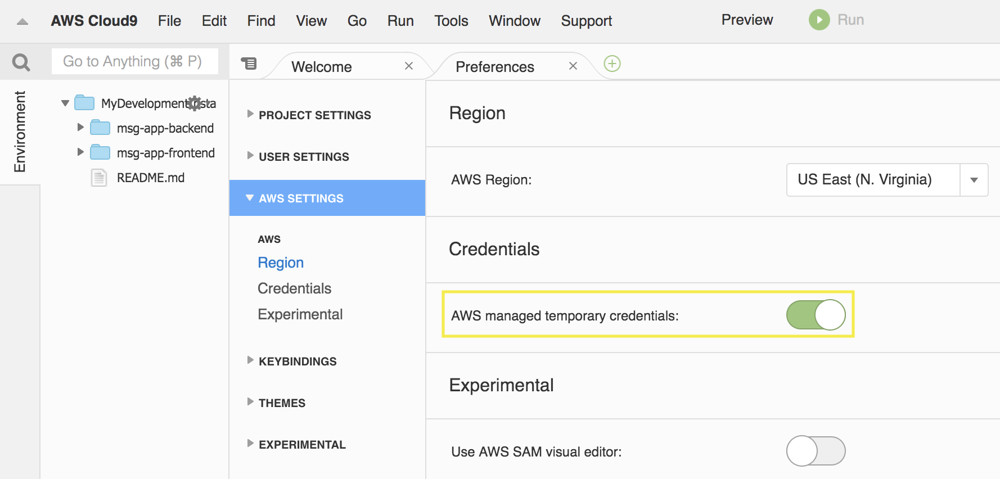
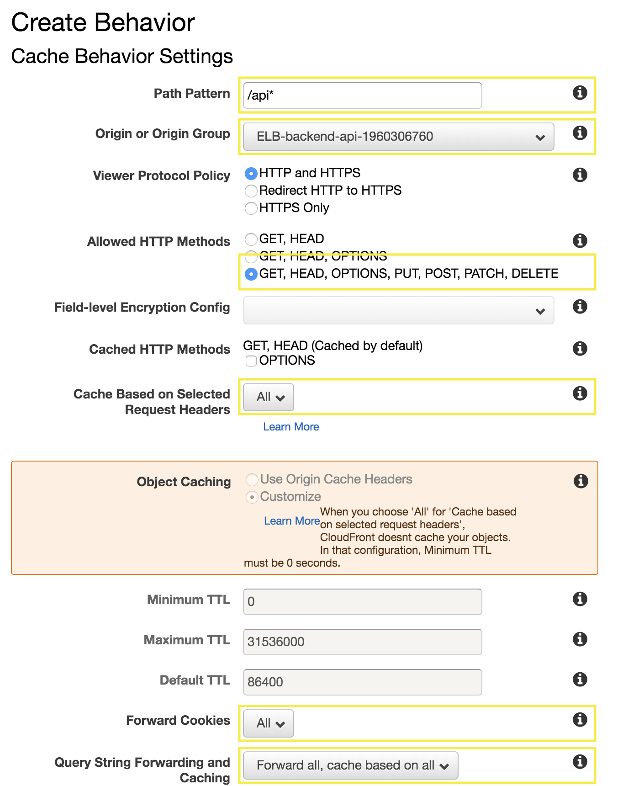

# Use ECS CLI to deploy the backend application

## 1. Update IAM settings for your Cloud9 Environment

1.1\. Inside the Cloud9 environment, click on **AWS Cloud9** and **Preferences**.


1.2\. Select **AWS SETTINGS** and turn on **AWS managed temporary credentials**.



1.3\. Inside the Cloud9 environment, in the **bash** terminal we are going to configure the AWS CLI as follows:

``` bash
aws configure
```

- Configuration:
    - AWS Access Key ID: **(Default)**
    - AWS Secret Access Key: **(Default)**
    - Default region name [us-east-1]: **us-east-1**
    - Default output format [json]: **json**


## 2. Install global dependencies

2.1\. Update Node.js to the minimal version of 10.

``` bash
nvm i v10
```

2.2\. Install Amplify CLI tool https://github.com/aws-amplify/amplify-cli

``` bash
npm install -g @aws-amplify/cli
```

2.3\. Install the Angular CLI globally.

``` bash
npm install -g @angular/cli
```

## 3. Clone the project and install dependencies

3.1\. Clone the Github project and install dependencies.

``` bash
git clone https://github.com/aurbac/msg-app-frontend.git
cd msg-app-frontend/
npm install
npm install --save aws-amplify aws-amplify-angular
```

3.2\. Edit the file **src/environments/environment.prod.ts** and change the value **path** with to your **`http://load-balancer-dns-name/api`** and save the file, use the editor included in Cloud9 environment.


## 4. Initialize amplify project

4.1\. Initialize the amplify project.

``` bash
amplify init
```

? Enter a name for the project **msg-app-frontend**

? Enter a name for the environment **dev**

? Choose your default editor: **Sublime Text**

? Choose the type of app that you're building **javascript**

Please tell us about your project

? What javascript framework are you using **angular**

? Source Directory Path:  **src**

? Distribution Directory Path: **dist/frontend** (Use this path)

? Build Command:  **npm run-script build**

? Start Command: **ng serve**

Using default provider  awscloudformation

For more information on AWS Profiles, see:

https://docs.aws.amazon.com/cli/latest/userguide/cli-multiple-profiles.html

? Do you want to use an AWS profile? **Yes**

? Please choose the profile you want to use **default**

## 5. Add hosting and publish your Angular project

5.1\. Add hosting to your amplify project.

``` bash
amplify add hosting
```

? Select the environment setup: **PROD (S3 with CloudFront using HTTPS)**

? hosting bucket name **msg-app-frontend-20190709233955-hostingbucket** (Use default name)

? index doc for the website **index.html**

? error doc for the website **index.html**

5.2\. Publish your Angular project.

``` bash
amplify publish
```

? Are you sure you want to continue? **Yes**

5.3\. After your app is published, use the endpoint resulted to get into your application.

## 6. Configure backend with Amazon CloudFront

6.1\. Open the Amazon CloudFront console at https://console.aws.amazon.com/cloudfront/.

6.2\. Choose your distribution and click on Distribution Settings.


6.3\. Go to **Origins and Origin Groups** tab and click on **Create Origin**.


6.4\. For **Create Origin** select your Application Load Balancer and choose **Create**.


6.5\. Go to **Behaviors** tab and click on **Create Behavior**.


6.6\. For **Create Behavior** complete as follows and choose **Create**:

* **Path Pattern**: **``/api*``**
* **Origin or Origin Group**: **``ELB-Backend-api-XXXXX``**
* **Allowed HTTP Methods**: **``GET, HEAD, OPTIONS, PUT, POST, PATCH, DELETE``**
* **Cache Based on Selected Request Headers**: **``All``**
* **Forward Cookies**: **``All``**
* **Query String Forwarding and Caching**: **``Forward all, cache based on all``**



## 7. Update Angular project with backend CloudFront

7.1\. Edit the file **src/environments/environment.prod.ts** and change the value **path** with to your **`https://cloudfront-domain-name/api`** and save the file, use the editor included in Cloud9 environment.


7.2\. Publish your Angular project.

``` bash
amplify publish
```

7.3\. Now test in your browser the application messages `https://cloudfront-domain-name/messages`, you will see the messages from backend.


!!! done
    **Now you have an Angular Application stored on Amazon S3 and a Nodejs backend using containers with Amazon ECS.**