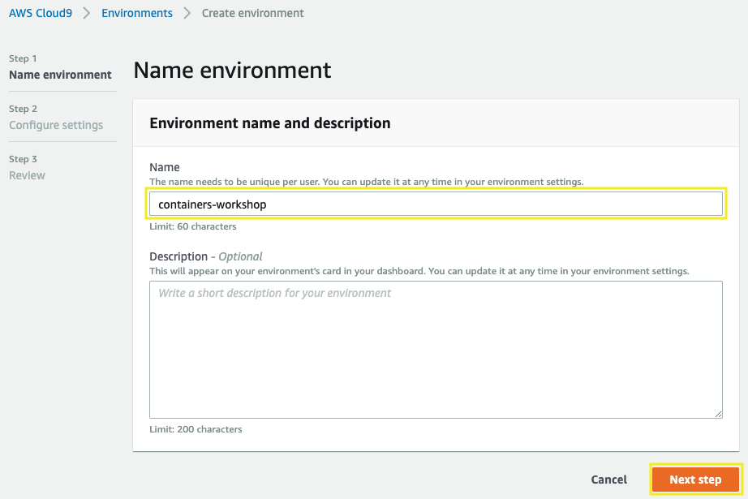
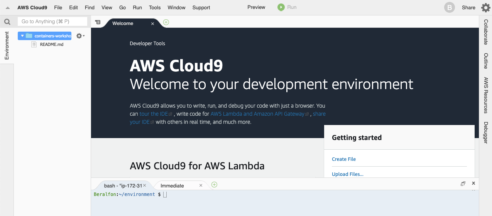
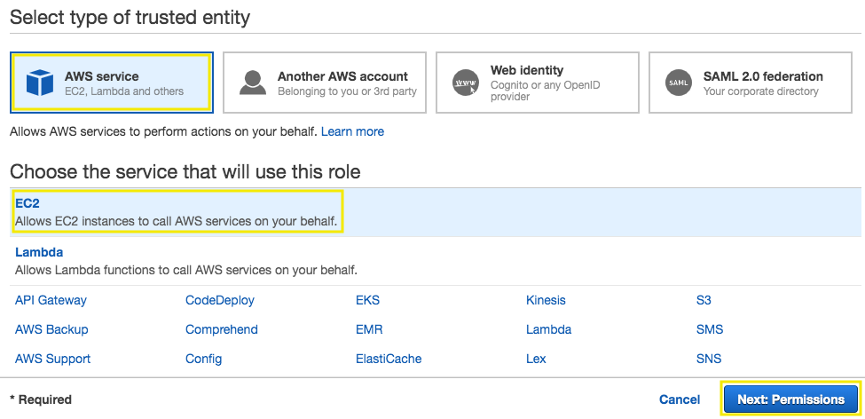
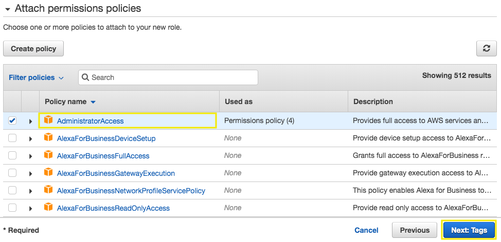
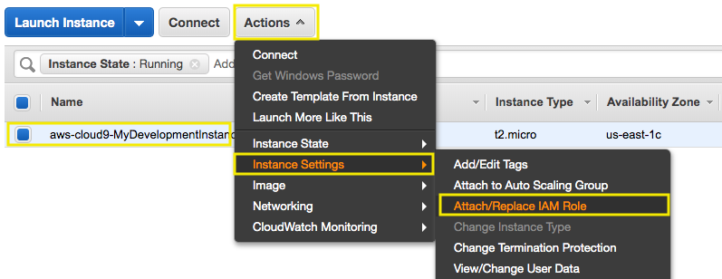
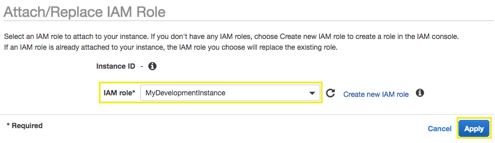
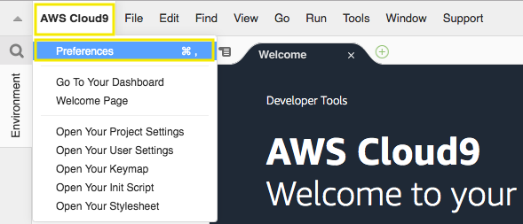
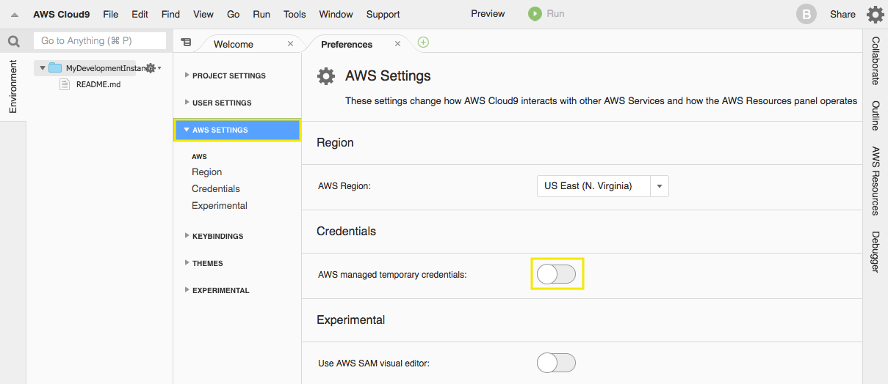
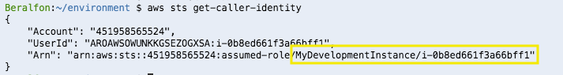

# Prepare your development environment

## 1. Create a Cloud9 instance for development

1.1\. Open the AWS Cloud9 console at https://console.aws.amazon.com/cloud9/.

1.2\. Click on **Create environment**.


1.3\. For the **Name** type `MyDevelopmentInstance`, and choose **Next step**.



1.4\. For the **Environment settings** use the default values and choose **Next step**.

1.5\. Click on **Create environment**.

1.6\. Wait some seconds until your development environment is ready, you will see the following screen.



## 2. Create your Amazon EC2 Service Role for the Cloud9 instance.

2.1\. Open the IAM console at https://console.aws.amazon.com/iam/.

2.2\. Choose **Roles**, then **Create role**.

2.3\. Choose **EC2** from the list of services, then **Next: Permissions**.



2.4\. For **Attach permissions policies** select **Administrator Access**, choose **Next: Tags**.



2.5\. For **Add tags** choose **Next: Review**.

2.6\. Give your role a **Name**, type `MyDevelopmentInstance` and choose **Create Role**.


## 3. Attach the IAM role to instance

3.1\. Open the Amazon EC2 console at https://console.aws.amazon.com/ec2/.

3.2\. In the navigation pane, choose **Instances**.

3.3\. Select your Cloud9 instance, choose **Actions**, **Instance Settings**, **Attach/Replace IAM role**.



3.4\. Select the IAM role **MyDevelopmentInstance** to attach to your instance, and choose **Apply**.




## 4. Update IAM settings for your Cloud9 Environment

4.1\. Inside the Cloud9 environment, click on **AWS Cloud9** and **Preferences**.



4.2\. Select **AWS SETTINGS** and turn off **AWS managed temporary credentials**.



4.3\. Ensure temporary credentials aren’t already in place, remove existing credentiasl with the following command:

```
rm -vf ${HOME}/.aws/credentials
```

4.4\. Validate the IAM role, it should contain the role name and instance Id, run the following command:

```
aws sts get-caller-identity
```



## 5. Install requirements

5.1\. Open the AWS Cloud9 console at https://console.aws.amazon.com/cloud9/.

5.2\. In the list of environments, for the environment you want to open, inside of the card, choose **Open IDE**.


5.3\. Inside the Cloud9 environment, in the **bash** terminal we are going to configure the AWS CLI as follows:

``` bash
aws configure
```

- Configuration:
    - AWS Access Key ID: **(Empty)**
    - AWS Secret Access Key: **(Empty)**
    - Default region name [us-east-1]: **us-east-1**
    - Default output format [json]: **json**

5.4\. Install the Amazon ECS CLI.

``` bash
sudo curl -o /usr/local/bin/ecs-cli https://amazon-ecs-cli.s3.amazonaws.com/ecs-cli-linux-amd64-latest
sudo chmod +x /usr/local/bin/ecs-cli
ecs-cli --version
```

Reference: https://docs.aws.amazon.com/AmazonECS/latest/developerguide/ECS_CLI_installation.html

5.5\. Install the JQ command.

``` bash
sudo yum install jq
```