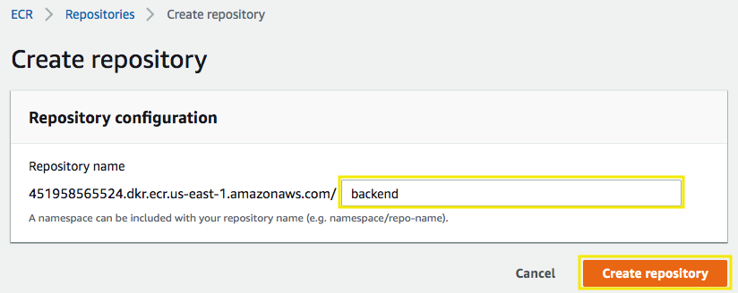
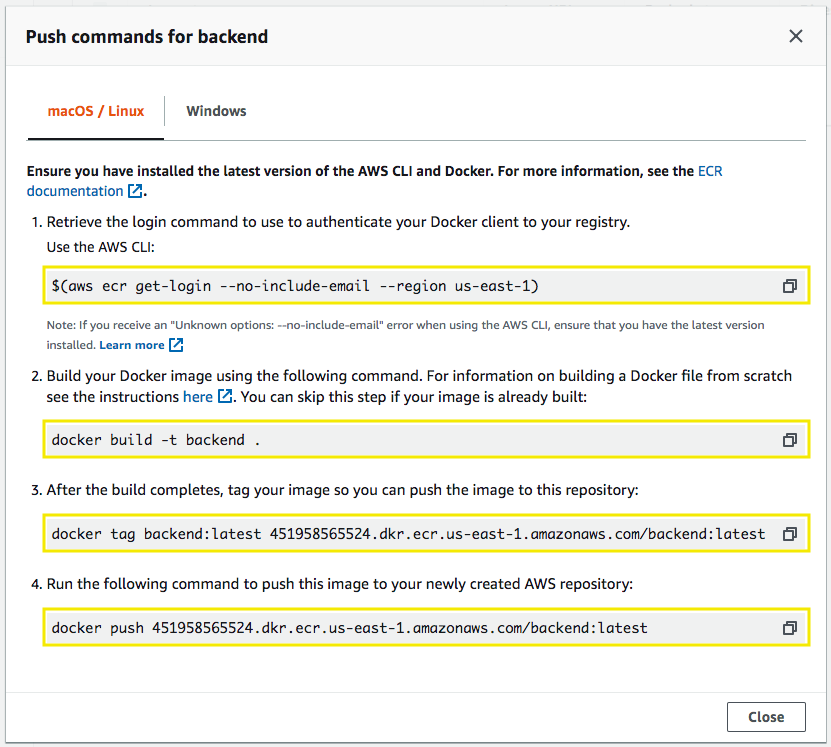
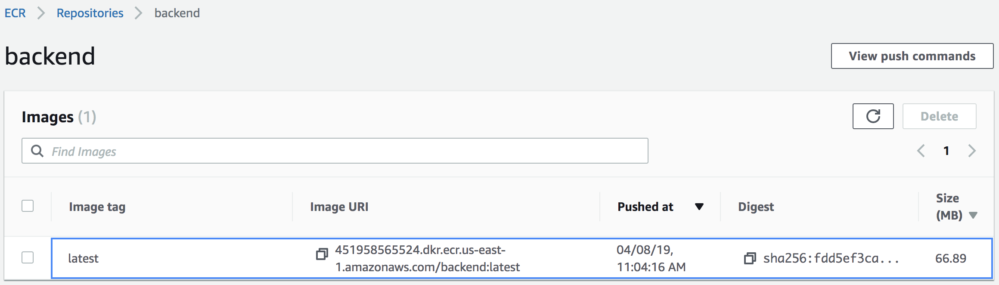
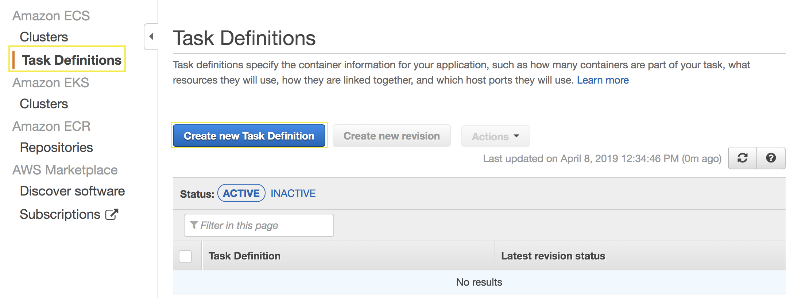
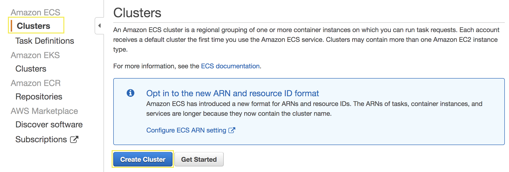

# Deploy a Node.js backend with Amazon ECS

## 1. Create the backend docker image and upload to Amazon ECR

1.1\. Inside your Cloud9 environment got to the backend folder.

```
cd /home/ec2-user/environment/nodejs-back-and-angular-front/backend
```

1.2\. Install the node dependencies.

```
npm install
```

1.3\. Open the Amazon ECR console at https://console.aws.amazon.com/ecr/repositories/.

1.4\. Click on **Create repository**, for the **Repository name** type `backend` and click **Create repository**.



**Note:** Copy the **URI** for the backend repository, you will use it later.

1.5\. Click on the repository name **backend** and then click on **View push commands**.

1.6\. Go back to your Cloud9 environment in your backend folder and execute the 5 commands of **Push commands for backend** (macOS/Linux).



1.7\. After pushing to AWS repository you will see the following image.



## 2. Create your Amazon ECS Task Execution IAM Role

2.1\. Open the IAM console at https://console.aws.amazon.com/iam/.

2.2\. Choose **Roles**, then **Create role**.

2.3\. Choose **Elastic Container Service** from the list of services, scroll down and choose **Elastic Container Service Task** that allows ECS tasks to call AWS services on your behalf for your use case, then **Next: Permissions**.


2.4\. For **attach permissions policies** filter by typing `AmazonECSTaskExecutionRolePolicy` and from the list select **AmazonECSTaskExecutionRolePolicy**, choose **Next: Tags**.


2.5\. For **Add tags** choose **Next: Review**.

2.6\. Give your role a **Name**, type `ecsTaskExecutionRole` and choose **Create Role**.


## 3. Create the Task Definition

3.1\. Open the Amazon ECS console at https://console.aws.amazon.com/ecs/.

3.2\. In the navigation pane, under **Amazon ECS**, choose **Task Definitions**.

3.3\. Choose **Create new Task Definition**.



3.4\. On the **Select launch type compatibility** use **FARGATE** and click on **Next step**.


3.5\. Complete the **Configure task and container definitions** page as follows:

* **``Task Definition Name``**: **``backend``**
* **``Task Role``**: Select **``None``**
* **``Task execution role``**: Select **``ecsTaskExecutionRole``**
* **``Task memory (GB)``**: Select **``0.5GB``**
* **``Task CPU (vCPU)``**: select **``0.25 vCPU``**

3.6\. Click on **Add container** and complete as follow and choose **Add**:

* **``Container Name``**: **``backend``**
* **``Image``**: paste the URI repository that you copied earlier in step 1.4.
* **``Port mappings``**: **``3000``** 


3.7\. Click on **Create**.

## 4. Create an Amazon ECS cluster and Service for the backend

4.1\. Open the Amazon ECS console at https://console.aws.amazon.com/ecs/.

4.2\. In the navigation pane, under **Amazon ECS**, choose **Clusters**.

4.3\. Choose **Create Cluster**.



4.4\. Select the option **Networking only - Powered by AWS Fargate** and click on **Next step**.


4.5\. For **Cluster name** type `backend-cluster` and click on **Create**.

4.6\. Click on **View Cluster**.

4.7\. In the **Services** sections click on **Create**.


4.8\. Complete the **Configure service** page as follows:

* **``Launch type``**: **``FARGATE``**
* **``Task Definition``**: **``backend``**
* **``Cluster``**: **``backend-cluster``**
* **``Service name``**: **``backend``**
* **``Number of tasks``**: **``1``** 


4.9\. Click on **Next step**.

4.10\. Complete the **Configure network** page as follows:

* **``Cluster VPC``**: `My VPC`
* **``Subnets``**: Select `Private Subnet 01` and `Private Subnet 02`
* **``Auto-assign public IP``**: `DISABLED`

4.11\. For **``Security Groups``** click on **Edit**.

4.12\. Complete as follows and click on **Save**:

* **``Type``**: **``Custom TCP``**
* **``Port range``**: **``3000``**

4.13\. For **Load balancer type** select **``Application Load Balancer``**.

4.14\. For **Load balancer name** select **``backend``**.

4.11\. Click on **Add to load balancer**.

4.12\. For **Target group name** select **``backend``**.

4.12\. Click on **Next step**.

4.10\. Complete the **Set Auto Scaling (optional)** page as follows:

* **``Service Auto Scaling``**: **``Configure Service Auto Scaling to adjust your service’s desired count``**
* **``Minimum number of tasks``**: **``2``**
* **``Desired number of tasks``**: **``2``**
* **``Maximum number of tasks``**: **``6``**
* **``IAM role for Service Auto Scaling``**: Select `Create new role` if available, otherwise leave it the same.
* **``Policy name``**: **``RequestCount``**
* **``ECS service metric``**: **``ALBRequestCountPerTarget``**
* **``Target value``**: **``100``**

4.11\. Click on **Next step**.

4.11\. Click on **Create Service**.

4.12\. Click on **View Service**.

4.13\. Open the Amazon EC2 console at https://console.aws.amazon.com/ec2/.

4.14\. In the navigation pane, under **LOAD BALANCING**, choose **Load Balancers**.

4.15\. Select the **backend** balancer, in the **Description** section copy the **DNS Name** to test in your bworser, you will see the code for the AWS Region.

4.16\. Test the DNS Name with `/messages` to see the messages.
