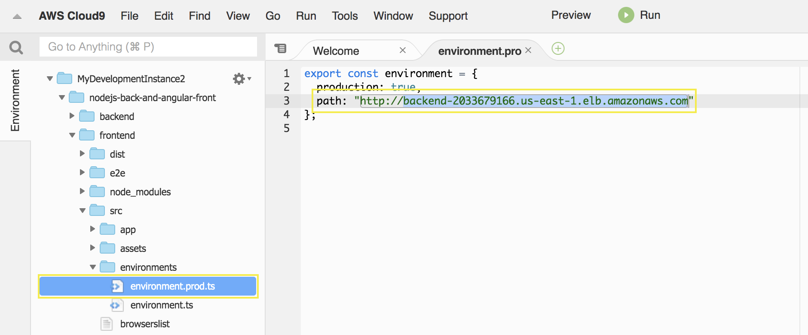
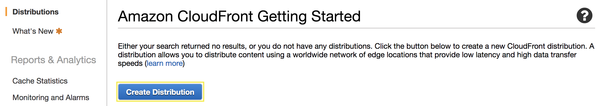
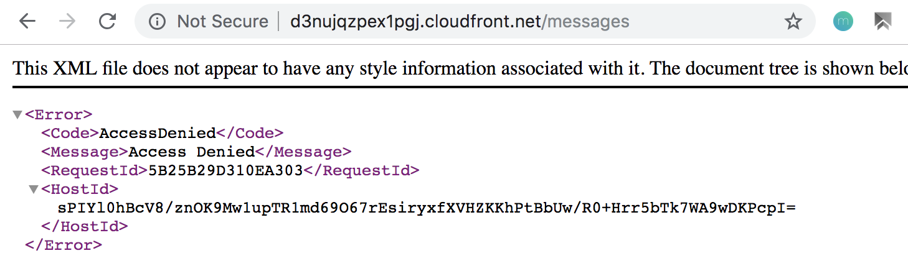
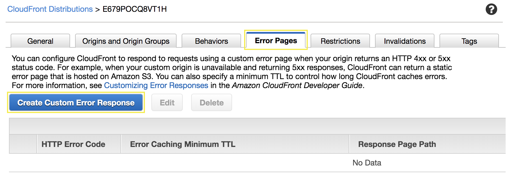
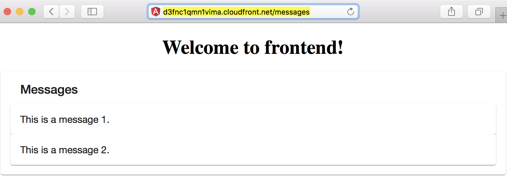

# Deploy an Angular frontend with Amazon S3 and Amazon Cloudfront

## 1. Upload Angular application to Amazon S3

1.1\. Open the Amazon S3 console at https://s3.console.aws.amazon.com/s3/.

1.2\. Choose **Create bucket**.

1.3\. In the **Bucket name** field, type a unique **DNS-compliant** name for your new bucket, for example `alias-frontend`. Create your own bucket name using the follow naming guidelines:

* The name must be unique across all existing bucket names in Amazon S3.
* After you create the bucket you cannot change the name, so choose wisely.
* Choose a bucket name that reflects the objects in the bucket because the bucket name is visible in the URL that points to the objects that you're going to put in your bucket.

1.4\. For **Region**, choose **US East (N. Virginia)** as the region where you want the bucket to reside.

1.5\. Choose **Create**.


1.6\. Inside your Cloud9 environment got to the frontend folder.

```
cd /home/ec2-user/environment/nodejs-back-and-angular-front/frontend
```

1.7\. Install the node dependencies.

```
npm install
```

1.8\. Edit the file **src/environments/environment.prod.ts** and change the value **path** with to your load balancer DNS Name, use the editor included in Cloud9 environment.



1.9\. Build the angular application for distrbution.

```
ng build --prod
```

1.10\. Upload the distribution files to your bucket, change `<your-bucket-name>` with your bucket name created.

```
aws s3 sync dist/frontend/ s3://<your-bucket-name>/
```


## 2. Deliver you application using Amazon CloudFront

2.1\. Open the Amazon CloudFront console at https://console.aws.amazon.com/cloudfront/.

2.2\. Choose **Create Distribution**.



2.3\. For **Web** choose **Get Started**.


2.4\. Complete the **Origin Settings** section as follows:

* **Origin Domain Name**: Select your bucket name created.
* **Restrict Bucket Access**: **``Yes``**
* **Origin Access Identity**: **``Create a New Identity``**
* **Grant Read Permissions on Bucke**: **``Yes, Update Bucket Policy``**


2.5\. Scroll down, in the **Distribution Settings** section, for **Default Root Object** type `index.html`.


2.6\. Click on **Create Distribution** and wait some minutes to apply the changes.

2.7\. Go back to https://console.aws.amazon.com/cloudfront/, once the distribution **Status** changes from **In Progress** to **Deployed**, copy the **Domain name** of your CloudFront distribution to test in your browser, you will see the message **Welcome to frontend!**.


2.8\. Test in your browser the application messages `<domain-name>/messages`, you will see an **Access Denied** error.

2.9\. Finally, now we need to configure **403** or **404** errors to redirect the traffic to index.html to resolve /messages.



2.10\. Select your distribution and click on **Distribution Settings**.

2.11\. Go to **Error Pages** tab and click on **Create Custom Error Response**.



2.12\. For **Custom Error Response Settings** complete as follows and click on **Create**:

* **HTTP Error Code**: **``403: Forbidden``**
* **Customize Error Response**: **``Yes``**
* **Response Page Path**: **``/index.html``**
* **HTTP Response Code**: **``200: Ok``**


2.13\. Repeat the process to create a new Custom Error Response for the **HTTP Error Code**: **``404: Not Found``**. 


2.14\. Go back to https://console.aws.amazon.com/cloudfront/ and wait some minutes to apply the changes, once the distribution **Status** changes from **In Progress** to **Deployed** you can continue.

2.15\. Now test in your browser the application messages `<domain-name>/messages`, you will see the messages from backend.



#### Congratulations, now you have an Angular Application stored on Amazon S3 and a Nodejs backend using containers with Amazon ECS.